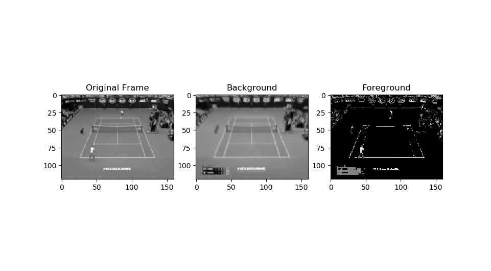

# ml-pca-foreground-removal

## Foreground/background Removal

This is an example machine learning application of separating foreground and background through the use of PCA.  
Usage:
1. Given a collection of frames of a clip, preprocess or compile these into a _.pkl_ file.
These images could be any format recognized by _matplotlib_ and could be extracted from a clip using 3rd party means.
For example, I used _VLC_ to extract around 700 frames or images in .bmp from a 40 second clip.
Note: these images are not included in this repository due to the sheer size... 
However, I did include sample _.pkl_ files (represents sample pre-processed frames in _input-preprocessed/_) for anyone eager to try the PCA part to play with the removal.
1. Given an already compiled _.pkl_ file that consists of nxd matrix (_ndarray_) of size n frames by d pixels, apply L1-PCA on this data set to identify
the moving parts and decompose each image into foreground and background. The output images are saved to _output/_. 
L1 objective function is arguably better at detecting outliers than L2 counter part.
Due to the fact that there's no avaiable L1-PCA implementation, I have in fact implemented it using _numpy_ and _scipy_.

Format: 

Format: 

### Command:
This application has two use cases: preprocess and remove background/foreground; hence, there are two main commands and one synthesis command.
* Pre-process:
    * `python removeForeground.py proprocess` is equivalent to `python removeForeground.py preprocess -i input -o unnamed -s 120 160`
    * The above command specifies _input_ as the directory containing images, _unnamed_ as output .pkl name, and rescales frames to _160x120_ pixel.
        After executing the command, you may also consider checking _input-preprocessed/_ to get an idea what has been stored into the .pkl file.
* PCA(Training):
    * `python removeForeground.py train` is equivalent to `python removeForeground.py train -d "*.pkl" -o "" -s 120 160`
    * The above command specifies _*.pkl_ pattern, _160x120_ pixel image resolution (this has to be consistent with what's stored in .pkl file). The output
        foreground and background images are stored in _output/_ with matching name as the _.pkl_ file.
* All(pre-process+training):
    * `python removeForeground.py all` is equivalent to `python removeForeground.py all -i input -o unnamed -s 120 160`
    * The above command specifies _input_ as the directory containing images, _unnamed_ as output .pkl name, and rescales frames to _160x120_ pixel;
        then separates foreground and background into _output/_.
        After executing the command, you may also consider checking _input-preprocessed/_ to get an idea what has been stored into the .pkl file.
Note: All three commands can be ran without optional arguments. For the first trial run, I would recommend running `python removeForeground.py all`
without any additional arguments. If your machine has more memory available, you could try running the larger _.pkl_ file.

### Included:
* source code
* sample .pkl file containing a matrix describing the images or frames: tennis_120x160.pkl, tennis_240x426.pkl
* sample pre-processed output images or frames of 160x120: _input-preprocessed/_
* sample output of foreground and background of 160x120: _output/_

### Requirement:
* 3rd party python packages: matplotlib, numpy, scipy, and skimage
* Python 3 (tested with 3.7.3 on Windows)
* Either a collection of image frames of a clip or a compiled matrix of size n image by d pixels in a .pkl file

Credit: Thanks to Mark Schmidt and Mike Gelbart at UBC for the ML course and giving me this idea.